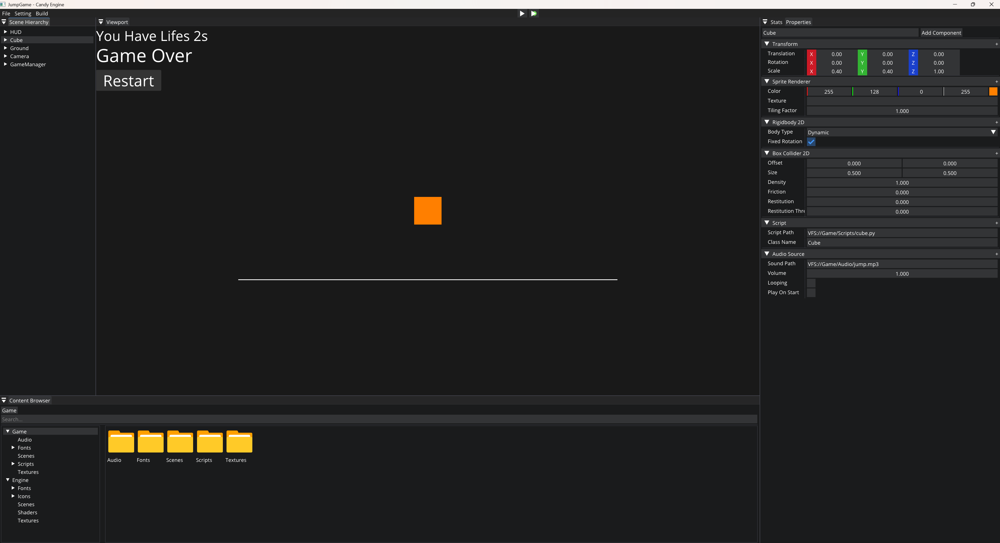

# CandyEngine

### Screenshot



CandyEngine is a 2D game engine written in C++20 with a built-in editor, built on an ECS architecture (powered by [EnTT](https://github.com/skypjack/entt)). The current architecture is inspired by and built upon [The Cherno](https://github.com/TheCherno)'s [Hazel Engine](https://github.com/TheCherno/Hazel), while the design philosophy further leans toward Godot and Unreal Engine — engine and editor as one integrated system, scene-as-data, and ECS as a means rather than an end.

### Quick Start


```bash
git clone --recursive https://github.com/xltangcs/CandyEngine.git
cd CandyEngine
.\Scripts\GenerateProjects.bat
```
### Done

| Module | Description |
|------|------|
| **Build System** | premake5 generates the project, supporting Debug / Release / Dist configurations |
| **Layer Stack** | Normal layers + overlays (ImGui is always an overlay), events propagate in LIFO reverse order |
| **ECS** | Based on EnTT; `Scene` holds an `entt::registry`, `Entity = entt::entity + Scene*` |
| **Rendering** | OpenGL backend with the `RendererAPI` abstraction; `Renderer2D` batches quads / circles / lines / sprites |
| **Physics** | Box2D integration: `Rigidbody2DComponent` (Static/Dynamic/Kinematic), `BoxCollider2DComponent`, `CircleCollider2DComponent`; runs only in Play / Simulate |
| **Native Scripting** | C++ `ScriptableEntity` base class + `NativeScriptComponent::Bind<T>()` |
| **Python Scripting** | pybind11 integrated, providing `candy.ScriptObject` (`on_construct` / `on_tick` / `on_destroy` lifecycle); the JumpGame sample is implemented purely in Python |
| **Editor** | Scene Hierarchy, Content Browser, Project Settings, Editor Settings |
| **3-State Scene Mode** | Edit (direct editing, no physics) / Play (deep-copied scene, physics + native scripts) / Simulate (deep copy, physics only, editor camera) |
| **Scene Serialization** | `.candy` files (yaml-cpp), human-readable, version-controllable, and mergeable |
| **Virtual File System** | VFS (`VFS://` protocol + Pak packaging) |
| **Audio** | miniaudio integration |
| **UI System** | `UITextBlockComponent` / `UIButtonComponent` and more |
| **Logging** | spdlog wrapper (`CANDY_CORE_*` / `CANDY_*`) |

**Sample Projects**
- **JumpGame**: a jump-and-dodge game demo implemented in pure Python scripts, located under `JumpGame/`.

### TODO

- **Multi-Backend RHI (DirectX 12 & Vulkan)**:
  - Abstract the renderer into a proper RHI layer on top of the current OpenGL `RendererAPI`.
  - Implement a **DirectX 12** backend.
  - Implement a **Vulkan** backend.

- **3D Support**:
  - Introduce 3D scene support (3D transforms, cameras, meshes, materials, lighting).

### Project Structure

| Directory | Target | Type | Purpose |
|------|------|------|------|
| `Candy/Source/` | `Candy` | Static library | Engine core |
| `CandyEditor/Source/` | `CandyEditor` | ConsoleApp | Editor (links `Candy`) |
| `JumpGame/` | — | Sample | Python-scripted game demo |
| `ThirdParty/` | — | Dependencies | Third-party libraries (including premake5, pybind11, and other submodules) |

### Acknowledgments

- This engine starts from and is inspired by [The Cherno](https://github.com/TheCherno)'s [Hazel Engine](https://github.com/TheCherno/Hazel); thanks to Yan Chernikov's tutorial series for laying the foundation of the engine architecture.
- The design goals further reference the editor and scene organization philosophy of [Godot](https://godotengine.org/) and [Unreal Engine](https://www.unrealengine.com/).

### License

This project is open-sourced under the **Apache License 2.0** (consistent with Hazel), including explicit patent grants and modification attribution requirements. See the `LICENSE` file in the repository root for details.

Key third-party dependencies and their licenses:

| Dependency | License |
|------|------|
| GLFW | zlib/libpng |
| GLAD | MIT |
| EnTT | MIT |
| imgui | MIT |
| ImGuizmo | MIT |
| glm | MIT (Happy Bunny) |
| spdlog | MIT |
| yaml-cpp | MIT |
| Box2D | MIT |
| pybind11 | BSD 3-Clause |
| stb_image | MIT / Public Domain |
| miniaudio | MIT / Public Domain |
| Open Sans (font) | SIL Open Font License 1.1 |
